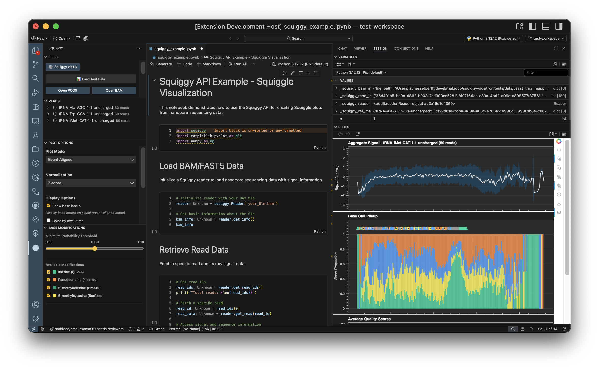

# Squiggy - Positron Extension

🚧 **squiggy is under active development.** *Caveat emptor*. 🚧

A Positron IDE extension for visualizing Oxford Nanopore sequencing data from POD5 files directly in your workspace.


[](https://open-vsx.org/extension/rnabioco/squiggy-positron)
[](https://codecov.io/gh/rnabioco/squiggy-positron)

## Overview

Squiggy is a Positron extension that integrates nanopore signal visualization into your data science workflow. Work with POD5 and BAM files directly in Positron, leveraging the active Python kernel for seamless data exploration.



**Key Features:**
- **Positron Integration**: Works with your active Python kernel - no separate environment needed
- **Interactive Visualization**: Bokeh-powered plots with zoom, pan, and hover tooltips
- **Base Annotations**: Overlay base calls and modifications on signal data when using BAM files
- **Read Filtering**: Search by read ID, reference region, or sequence motif
- **Modification Analysis**: Filter and visualize base modifications (5mC, 6mA, etc.) with probability thresholds
- **Aggregate Plots**: Multi-read visualizations with modification heatmaps, dwell time, and quality tracks

## Project-Based Workflow

> [!IMPORTANT]
> **Squiggy follows a strict project-based workflow**. You must:
> 1. Open a specific project directory in Positron (not the home directory)
> 2. Have a project-specific virtual environment with `squiggy-positron` installed
> 3. Work with data files within or relative to that project
>
> This follows [tidyverse workflow principles](https://tidyverse.org/blog/2017/12/workflow-vs-script/) - your analysis should be reproducible and self-contained within a project directory.

## Installation

> [!IMPORTANT]
> Squiggy requires the `squiggy-positron` Python package to be installed **before** using the extension. Follow these steps in order:

### 1. Create a Project Directory

```bash
# Create a project directory for your analysis
mkdir my-nanopore-analysis
cd my-nanopore-analysis

# Open this directory in Positron
# File → Open Folder → Select my-nanopore-analysis
```

### 2. Install Python Package

Install the `squiggy-positron` Python package in a **project-specific** virtual environment:

```bash
# Create project-specific virtual environment
uv venv

# Activate it
source .venv/bin/activate  # macOS/Linux
# OR
.venv\Scripts\activate     # Windows

# Install squiggy-positron from PyPI
uv pip install squiggy-positron
```

> **Note**: While the PyPI package is named `squiggy-positron`, you import it as `import squiggy`.

### 3. Install Positron Extension

Then install the Squiggy extension in Positron:

1. Download the latest `.vsix` file from [Releases](https://github.com/rnabioco/squiggy-positron/releases)
2. In Positron: `Extensions` → `...` → `Install from VSIX...`
3. Select the downloaded `.vsix` file

Or install from the Open VSX Registry (when available):
- Search for "Squiggy" in Positron's Extensions panel

> For development installation, see the [Developer Guide](https://rnabioco.github.io/squiggy-positron/developer-guide/).

## Quick Start

### 1. Load Data Files

Open the Squiggy sidebar (click the Squiggy icon in the activity bar):

- **Open POD5 File**: Load your nanopore signal data
- **Open BAM File** (optional): Add alignments for base annotations and advanced filtering

### 2. Browse Reads

The **Reads** panel shows all reads in the POD5 file:
- Grouped by reference if BAM file is loaded
- Use the search bar to filter by read ID or reference name
- Click any read to visualize

### 3. Customize Plots

The **Plotting** panel provides three analysis workflows:

#### Per-Read Plots
View individual reads with overlay or stacked layouts:
- **Overlay**: Alpha-blended signals on shared axes (good for pattern comparison)
- **Stacked**: Vertically offset signals (squigualiser-style, best for ≤20 reads)
- Configure max reads per sample (2-100)
- Requires: POD5 file

#### Composite Read Plots (Aggregate)
Multi-read statistics aligned to a reference sequence:
- Select reference sequence and max reads (10-500)
- **View Style** (for 2+ samples):
  - *Overlay*: Mean signals from all samples on one plot
  - *Multi-Track*: Detailed 5-track view for each sample
- **Visible Panels** (toggle individually):
  - Base modifications - Heatmaps showing modification frequency and confidence
  - Base pileup - Coverage and base composition
  - Dwell time - Mean dwell with confidence bands
  - Signal - Mean normalized signal with confidence bands
  - Quality scores - Mean quality with confidence bands
- **X-Axis Display**:
  - Clip to consensus region (focus on high-coverage areas)
  - Transform to relative coordinates (anchor position 1 to first reference base)
- Requires: BAM file with alignments

#### 2-Sample Comparisons
Compare signal differences between exactly two samples:
- Select exactly 2 samples from Sample Manager
- Choose reference sequence
- Generates delta plots showing signal differences (B - A)
- Configure max reads per sample (10-500)
- Requires: 2 samples with BAM files

#### Common Options (All Plot Types)
- **Normalization**: None, Z-score, Median, or MAD
- **Sample Manager Integration**: Use eye icons in Sample Manager to select which samples to visualize

> **Tip**: For multi-sample workflows, enable the samples you want to visualize using the eye icons in the Sample Manager panel, then choose your analysis type in the Plotting panel.

### 4. Explore Modifications (BAM with MM/ML tags)

If your BAM file contains base modifications:
- The **Base Modifications** panel appears automatically
- Filter by modification type (5mC, 6mA, etc.)
- Set probability threshold to focus on high-confidence calls
- Toggle coloring by dwell time vs modification probability

### 5. Export Plots

- **File → Export Plot** (Ctrl/Cmd+E)
- Formats: HTML (interactive), PNG, SVG
- Option to export at current zoom level

## Python API for Notebooks

Squiggy provides an object-oriented Python API for use in Jupyter notebooks and Python scripts. See [`examples/notebook_api_demo.ipynb`](examples/notebook_api_demo.ipynb) for a complete tutorial.

## Architecture

Squiggy uses the **Strategy Pattern** to make adding new plot types easy and maintainable:

- **PlotFactory** - Creates the appropriate plotting strategy based on plot mode
- **7 Plot Strategies** - Each plot type (SINGLE, OVERLAY, STACKED, EVENTALIGN, AGGREGATE, DELTA, SIGNAL_OVERLAY_COMPARISON) is a separate strategy class
- **Reusable Components** - ThemeManager, BaseAnnotationRenderer, ModificationTrackBuilder shared across strategies
- **Easy Extension** - Adding new plot types requires only creating a new strategy class

This design makes it straightforward to add new visualization types (like A/B comparison plots) without modifying existing code.

See the [Developer Guide](https://rnabioco.github.io/squiggy-positron/developer-guide/#strategy-pattern-architecture) for detailed architecture documentation.

## Requirements

- **Positron IDE** (version 2025.6.0+)
- **Python 3.12+** with a virtual environment
- **uv** for Python package management
- **squiggy-positron Python package** (installed via `uv pip install squiggy-positron`)

### Python Environment Setup

Use `uv` for fast, reliable Python environment management:

```bash
# Install uv (if not already installed)
# macOS/Linux
curl -LsSf https://astral.sh/uv/install.sh | sh
# Windows
powershell -c "irm https://astral.sh/uv/install.ps1 | iex"

# Create virtual environment and install squiggy-positron
uv venv
source .venv/bin/activate  # macOS/Linux
# OR
.venv\Scripts\activate     # Windows

uv pip install squiggy-positron  # Includes: pod5, bokeh, numpy, pysam
```

> **Important**: Always use a project-based virtual environment. The extension will check for the `squiggy-positron` package when you first try to load data, and will provide installation instructions if it's not found.

### Optional Requirements

- **BAM file** with basecalls for advanced features (event-aligned plots, modifications)

## Documentation

📚 **Full documentation available at [rnabioco.github.io/squiggy-positron](https://rnabioco.github.io/squiggy-positron/)**

- [User Guide](https://rnabioco.github.io/squiggy-positron/user-guide/) - Complete usage guide
- [Developer Guide](https://rnabioco.github.io/squiggy-positron/developer-guide/) - Extension development setup
- [API Reference](https://rnabioco.github.io/squiggy-positron/api/) - Python API documentation

## Contributing

Contributions are welcome! Please see the [Developer Guide](https://rnabioco.github.io/squiggy-positron/developer-guide/) for:
- Development setup
- Coding standards
- Testing guidelines
- Pull request process

## License

This project is licensed under the MIT License - see the [LICENSE](LICENSE) file for details.

## Acknowledgments

- **Positron Team** at Posit for the excellent IDE and extension API
- **Oxford Nanopore Technologies** for POD5 format and libraries
- **[Remora](https://github.com/nanoporetech/remora)** - Modified base calling toolkit
- **[Squigualiser](https://github.com/hiruna72/squigualiser)** - Signal visualization inspiration

## Citation

If you use Squiggy in your research, please cite:

```
[Citation information to be added]
```

## Support

- **Issues**: [GitHub Issues](https://github.com/rnabioco/squiggy-positron/issues)
- **Discussions**: [GitHub Discussions](https://github.com/rnabioco/squiggy-positron/discussions)
