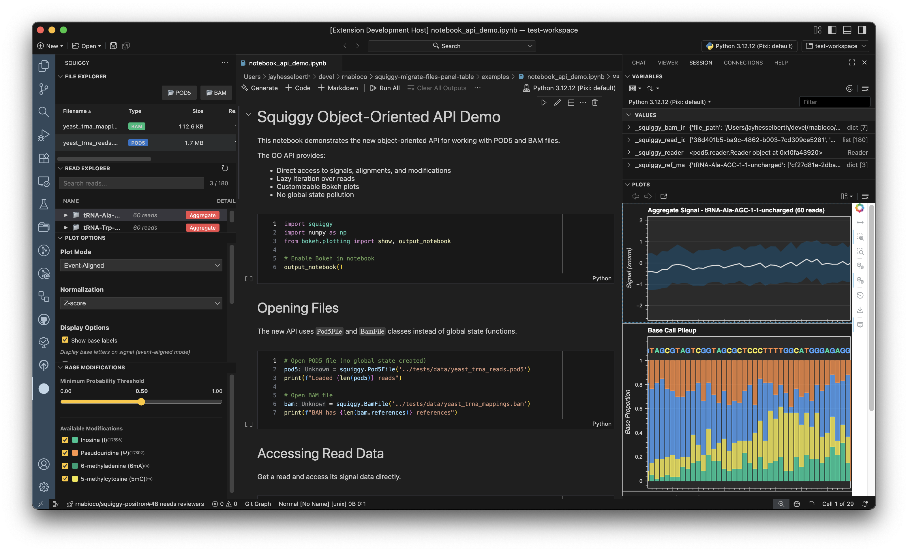

# Squiggy - Positron Extension

Squiggy is a Positron IDE extension for visualizing Oxford Nanopore sequencing data from POD5 files directly in your workspace.

## Documentation

- **[User Guide](user_guide.md)** - Complete guide to using the extension
- **[Multi-Sample Comparison Guide](multi_sample_comparison.md)** - Compare 2+ POD5 datasets with delta tracks
- **[Quick Reference](quick_reference.md)** - Commands, shortcuts, and common workflows
- **[Developer Guide](developer.md)** - Setup and contribution guide
- **[API Reference](api.md)** - Python package documentation

## Features

- **Positron Integration**: Works with your active Python kernel
- **Interactive Visualization**: Bokeh-powered plots with zoom, pan, and hover
- **Base Annotations**: Overlay base calls on signal data (requires BAM file)
- **Read Filtering**: Search by read ID, reference region, or sequence motif
- **Modification Analysis**: Filter and visualize base modifications with probability thresholds
- **Multi-Sample Comparison**: Load 2-6+ samples and compare with delta tracks showing differences

## System Requirements

- **Positron IDE**: Version 2025.6.0 or later
- **Operating Systems**: macOS (Intel/Apple Silicon), Linux, Windows
- **Python**: 3.12 or later
- **Memory**: 4GB RAM minimum (8GB recommended for large POD5 files)
- **Disk Space**: Varies by dataset size (POD5 files can be several GB)

## Installation

### Install from OpenVSX (Recommended)

1. Open Positron IDE
2. Open Extensions panel (`Cmd+Shift+X` / `Ctrl+Shift+X`)
3. Search for "Squiggy"
4. Click **Install**

Or visit the [OpenVSX marketplace page](https://open-vsx.org/extension/rnabioco/squiggy-positron).

### First Time Setup

When you first use Squiggy, it automatically:

1. Creates a dedicated virtual environment at `~/.venvs/squiggy`
2. Installs the bundled `squiggy` Python package using `uv`
3. Configures a background kernel for extension operations

**No manual Python package installation required!** The extension handles everything.

> **Note:** The automatic setup requires `uv` to be installed. If `uv` is not found, you'll be prompted to install it.

### Alternative: Install from VSIX

Download the latest `.vsix` file from [GitHub Releases](https://github.com/rnabioco/squiggy-positron/releases) and install via `Extensions` → `...` → `Install from VSIX...`
