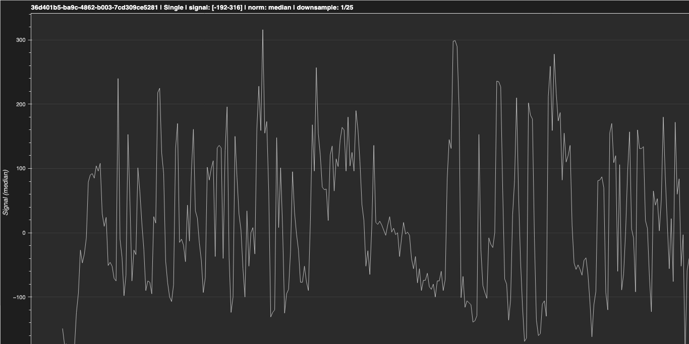
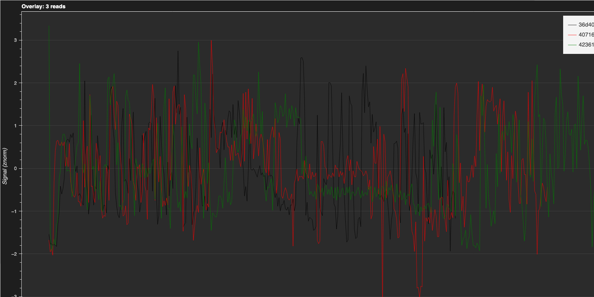
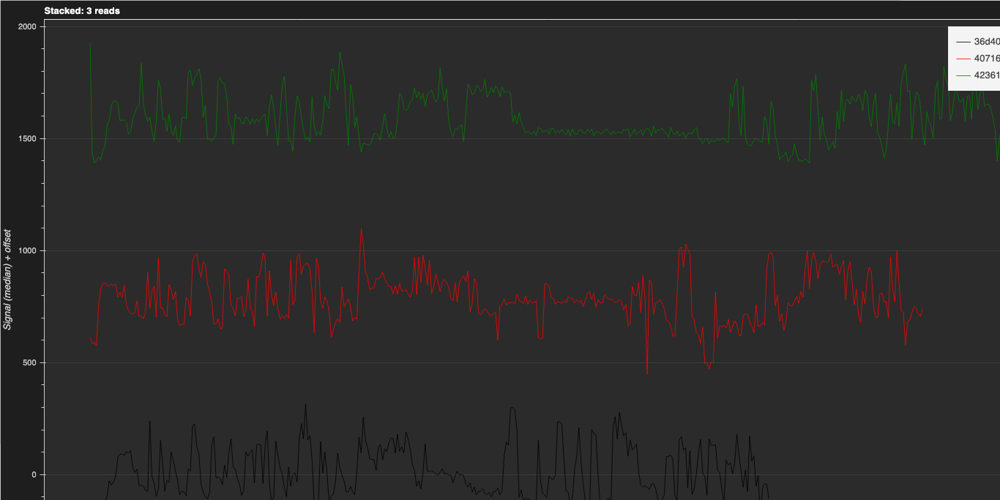
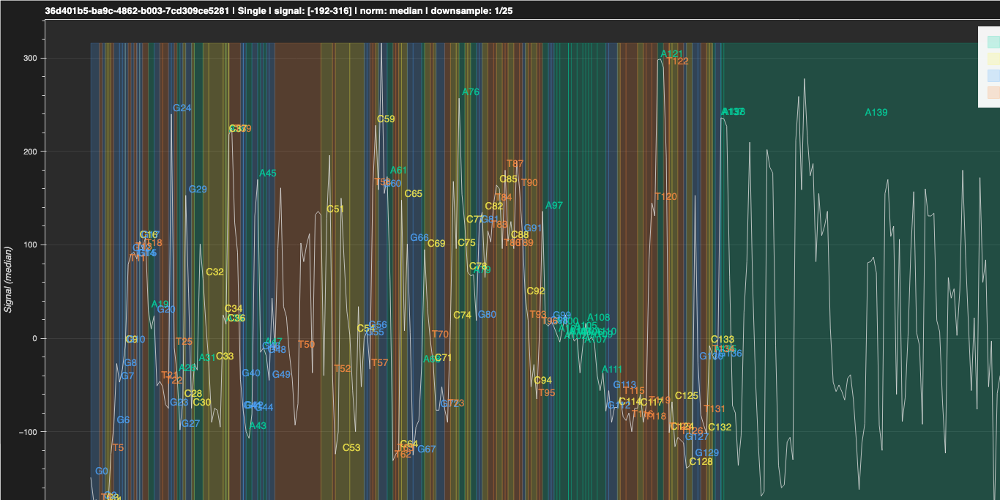
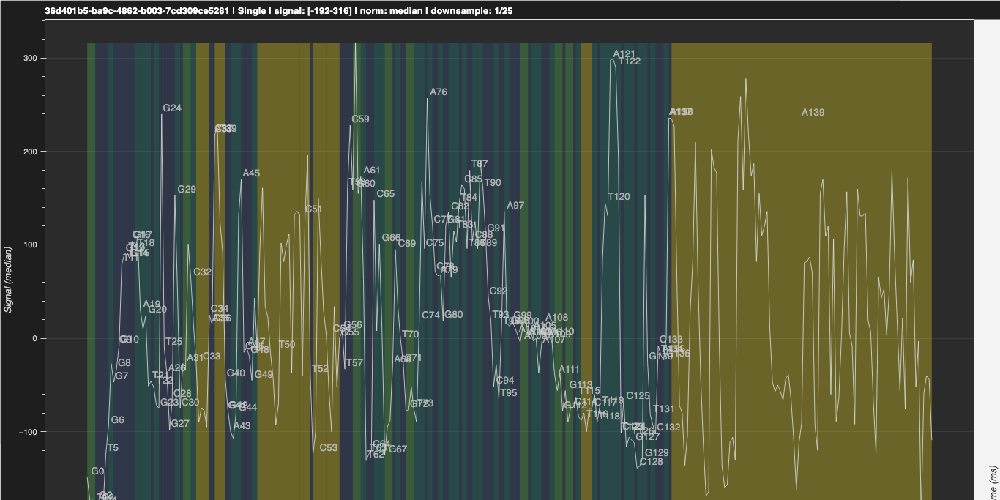
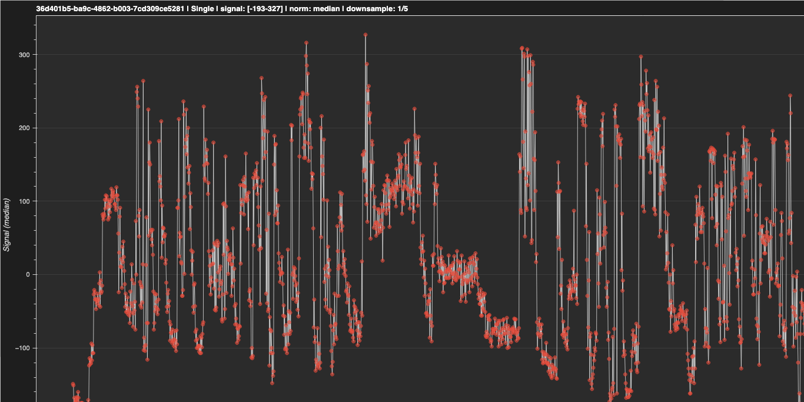

# Usage

## Opening POD5 Files

1. Launch Squiggy
2. Click the **"Open POD5 File"** button or use **File → Open POD5 File** (Ctrl/Cmd+O)
3. Navigate to and select your POD5 file
4. The application will load all available reads

Alternatively, you can:
- Use **File → Open Sample Data** (Ctrl/Cmd+Shift+O) to load the bundled sample POD5 file
- Launch with a file from command line: `squiggy --pod5 /path/to/file.pod5`

## Optional: Adding Base Annotations

Squiggy can display base annotations overlaid on the signal if you have a BAM file with basecalls:

1. After loading a POD5 file, click **"Open BAM File"**
2. Select the corresponding BAM file (must contain the same read IDs)
3. The **"Event-aligned"** plot mode will become available

**Requirements:**
- The BAM file must contain move tables (generated by modern Oxford Nanopore basecallers like Dorado or Guppy)
- Install pysam: `pip install pysam`

## Viewing Reads

Once a POD5 file is loaded:

- **Read List**: All read IDs from the file appear in the left panel
- **Search**: Use the search box to filter reads by ID
- **Single Selection**: Click any read ID to visualize it
- **Multiple Selection**: Hold Ctrl/Cmd and click to select multiple reads, or Shift+click for ranges

## Plot Modes

Squiggy offers multiple visualization modes (expand **Plot Options** panel to access):

### Single Read Mode (Default)
- Displays one read at a time
- Best for examining individual read quality and characteristics
- Shows time (seconds) on X-axis, raw signal (pA) on Y-axis

*Figure: Single read visualization with median normalization*

### Overlay Mode
- Displays multiple reads on the same axes
- Best for comparing signal variation across reads
- Supports up to 10 reads simultaneously
- Each read shown in a different color (colorblind-friendly palette)
- Requires normalization for meaningful comparison

*Figure: Overlay mode comparing three reads with z-score normalization*

### Stacked Mode (Squigualiser-style)
- Displays multiple reads vertically offset
- Best for visualizing patterns across multiple reads
- Each read is vertically spaced for clarity
- Great for seeing consensus signal behavior

*Figure: Stacked mode showing three reads with vertical spacing*

### Event-Aligned Mode
- Displays reads with base annotations (requires BAM file)
- Shows bases with fixed width (one unit per base)
- Colored bands indicate bases using Okabe-Ito colorblind-friendly palette:
  - Purines (A, G): Green/Blue tones
  - Pyrimidines (C, T): Yellow/Orange tones
- Signal is averaged per base for cleaner visualization
- Best for examining base-level signal characteristics

*Figure: Event-aligned mode with base annotations showing base-to-signal alignment*

The event-aligned mode also supports dwell time scaling, which adjusts the x-axis to reflect the actual time spent on each base:

*Figure: Event-aligned mode with dwell time scaling enabled*

### Aggregate Mode
- Displays multi-read pileup statistics for a reference sequence (requires BAM file)
- Shows three synchronized tracks:
  - **Signal Track**: Mean signal with confidence bands (±1 std dev)
  - **Base Pileup**: IGV-style stacked bars showing base proportions at each position
  - **Quality Track**: Mean quality scores across reads
- Best for examining consensus signal patterns and base calling accuracy
- Searchable by reference sequence name from the reference browser

## Signal Normalization

Normalization is crucial when comparing signals across reads. Available methods:

- **None (raw signal)**: Original pA values - best for single read examination
- **Z-score**: Mean=0, Std=1 - best for comparing reads (default for multi-read modes)
- **Median**: Median-centered - robust to outliers
- **MAD (Median Absolute Deviation)**: Most robust - handles extreme outliers well

## Understanding Squiggle Plots

The squiggle plot shows:

- **X-axis**: Time (seconds) or base position (depending on mode)
- **Y-axis**: Signal (pA or normalized units)
- **Line color**: Indicates different reads in multi-read modes

Each peak and valley represents ionic current changes as DNA/RNA molecules pass through the nanopore.

### Visualizing Signal Points

You can enable the display of individual signal data points to see the discrete measurements:

*Figure: Signal visualization with individual data points shown (downsampled)*

## Exporting Plots

You can export the currently displayed plot in multiple formats:

1. Display the plot you want to export
2. Go to **File → Export Plot** (Ctrl/Cmd+E)
3. In the export dialog, choose your options:
   - **Format**: HTML (Interactive), PNG (Raster Image), or SVG (Vector Graphics)
   - **Dimensions** (for PNG/SVG): Set width and height in pixels (default: 1400 × 900)
   - **Lock Aspect Ratio**: Keep proportions when resizing
   - **Export current zoom level**: Export only the visible zoomed region (unchecked = export full plot)
4. Click **OK**, then choose save location and filename
5. Click **Save**

### Export Formats

- **HTML (Interactive)**
  - Preserves all interactivity (zoom, pan, hover tooltips)
  - Best for sharing interactive visualizations
  - No extra dependencies required
  - Open in any web browser

- **PNG (Raster Image)**
  - Fixed-resolution bitmap image
  - Good for presentations, documents, and publications
  - Set custom dimensions (recommended: ≥1200px width for clarity)
  - **Standalone builds**: Works out of the box
  - **Source installations**: Requires export dependencies (see Installation docs)

- **SVG (Vector Graphics)**
  - Scalable without quality loss
  - Editable in graphics software (Inkscape, Adobe Illustrator)
  - Best for publications and high-quality figures
  - **Standalone builds**: Works out of the box
  - **Source installations**: Requires export dependencies (see Installation docs)

### Export Tips

- **Zoom before export**: Check the "Export current zoom level" option to capture only your zoomed region of interest
- **Larger dimensions**: For high-quality prints, use 1600×1000 or larger for PNG/SVG
- **Keep aspect ratio locked**: Prevents distortion when resizing
- **Interactive HTML**: Use HTML format when you want readers to be able to zoom and explore the data themselves

## Tips

- **Large files**: POD5 files can contain thousands of reads. Use the search box to quickly find specific reads
- **Multi-read comparison**: Use Overlay mode with Z-score normalization to compare signal patterns
- **Plot quality**: Plots are generated at high resolution suitable for screenshots and presentations
- **Performance**: The first read visualization may take a moment as libraries initialize; subsequent plots render quickly
- **Collapsible panels**: Click "POD5 File Information" or "Plot Options" headers to expand/collapse panels

## Keyboard Shortcuts

- **Ctrl/Cmd + O**: Open POD5 file dialog
- **Ctrl/Cmd + Shift + O**: Open sample data
- **Ctrl/Cmd + E**: Export current plot
- **Ctrl/Cmd + D**: Toggle dark/light theme
- **Ctrl/Cmd + Q**: Quit application

## File Format Support

Squiggy supports POD5 files, which are the standard format for Oxford Nanopore raw signal data:

- POD5 is an HDF5-based format with VBZ compression
- Files typically have `.pod5` extension
- Contains raw signal data plus metadata (sample rate, read IDs, etc.)

## Troubleshooting

**Application won't start**
- On macOS: Check System Preferences → Security & Privacy to allow the app
- First launch may require right-clicking the app and selecting "Open"

**Can't open POD5 file**
- Verify the file is a valid POD5 format
- Check that the file isn't corrupted or incomplete

**Plots not displaying**
- Ensure the read has valid signal data
- Try selecting a different read to verify functionality
